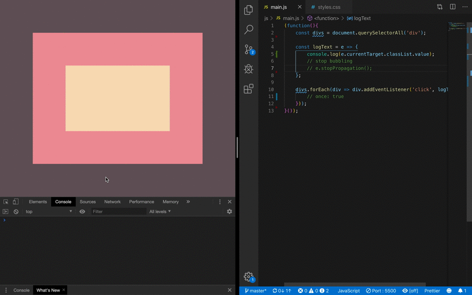
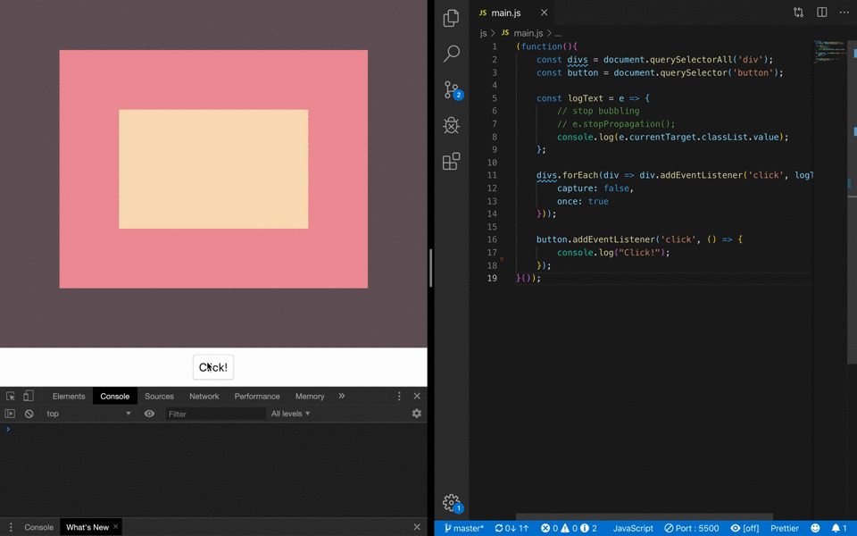

# 25. JavaScript Capture, Bubbling, Propagation and Once

#### _JavaScript Capture, Bubbling, Propagation and Once by JavaScript30 10/29/19_

## Description
This is JavaScript Capture, Bubbling, Propagation and Once demo, 25th application out of 30 by 30 day Vanilla JavaScript Coding Challenge by Wes Bos.<br>
Please check the challenge from [JavaScript30](http://wesbos.com/javascript30/).


## About this Application
This is the demo to show the event capture, bubbling, propagation and once.
There are three nested `divs`. Each class names are:
1. `.one` - the outer div with brown color
2. `.two` - the middle div with pink color 
3. `.three` - the inner div with yellow color

### Demo 1 - Nested Divs
Check the normal click event, `stopPropagation()` and eventListener's once option.


### Demo 2 - Button Click
Check the eventListener's once option on a button.



#### Event propagation
- Event **capturing** is a type of event propagation; when an element is clicked, the element will be targeted through the top of the DOM tree down to the target element. When `.three` is clicked, the event goes through `document` -> `html` -> `body` -> `.one` -> `.two` -> `.three`

- Event **bubbling** is a type of event propagation; where the event triggers on the innermost target element, and then triggers on the ancestors of the target element till it reaches the outmost DOM element or document object.

- `stopPropagation()` prevents the event from bubbling further up into the DOM. After `e.stopPropagation()` in `logText` function is uncommented in demo 1, the clicked div doesn't print out the ancestors' div classnames anymore.

- `once` option - This is an option of `.addEventListener()`. This allows that the event invoked only once.


## Setup/Installation

1. Clone this repo:
```
$ git clone https://github.com/misakimichy/JS30-25-js-capture.git
```

2. Navigate to the top level of the cloned directory.

3. Open index.html with your preferred web browser.

4. Play with your browser's dev tool.

## Known Bugs
* No known bugs at this time.

## Support and contact details
 I welcome any feedbacks and comments: misaki.koonce@gmail.com

## Technologies Used
_Git, GitHub, HTML, CSS, Vanilla JavaScript

## License
Copyright © 2019 under the MIT License